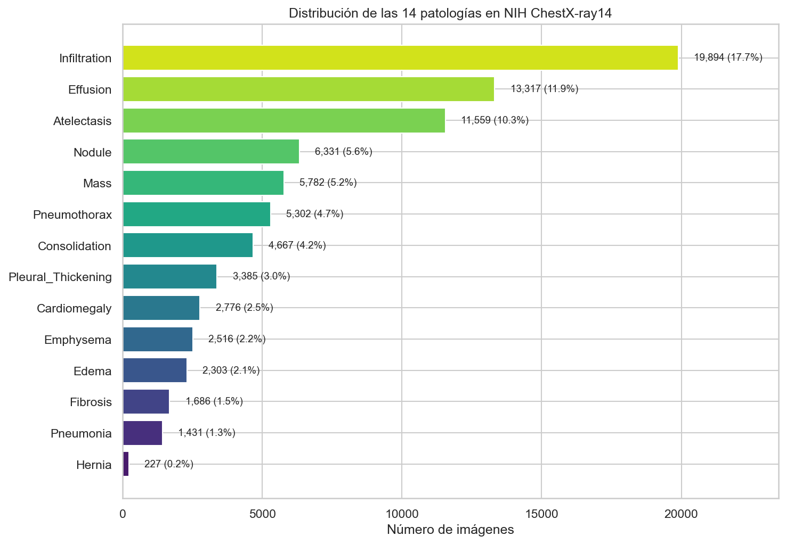
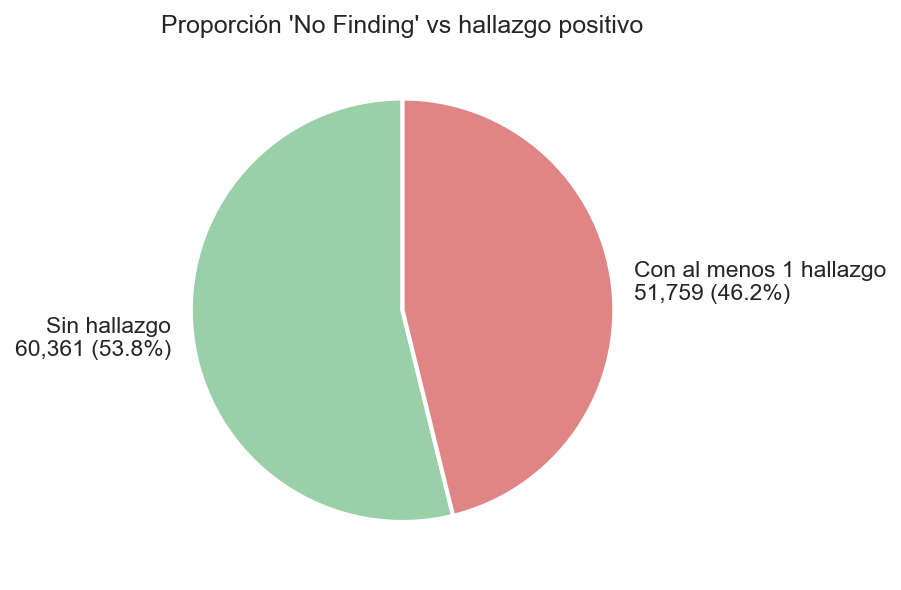
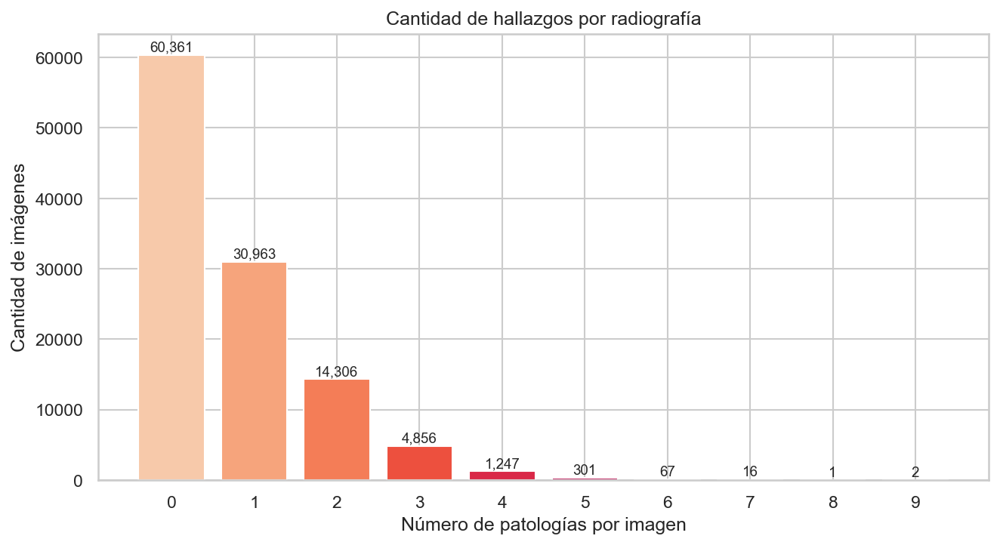
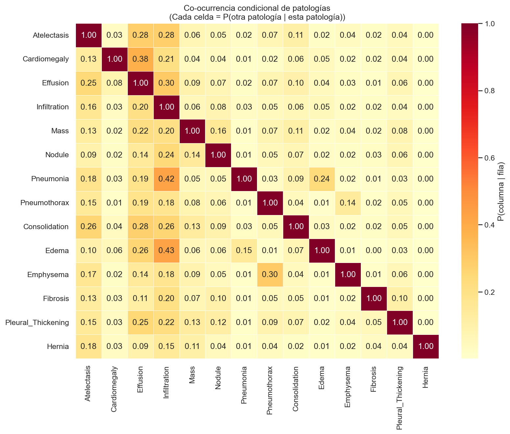
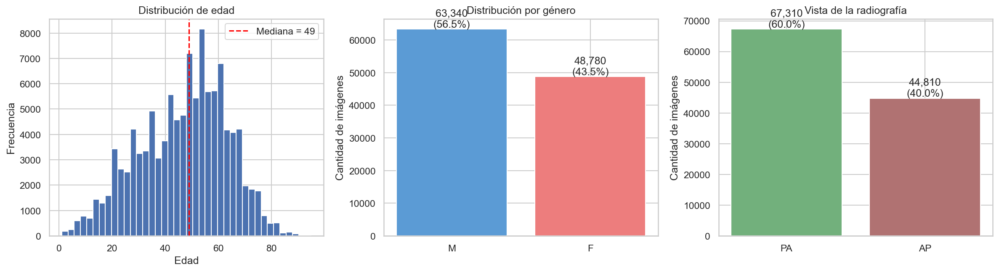
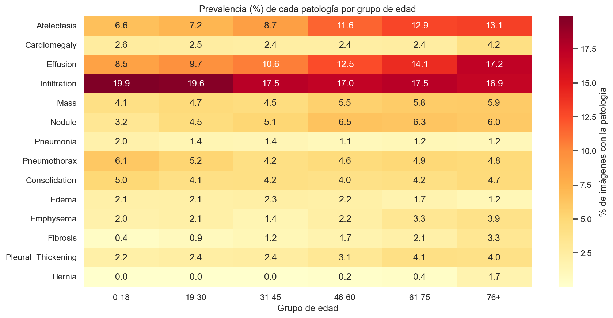
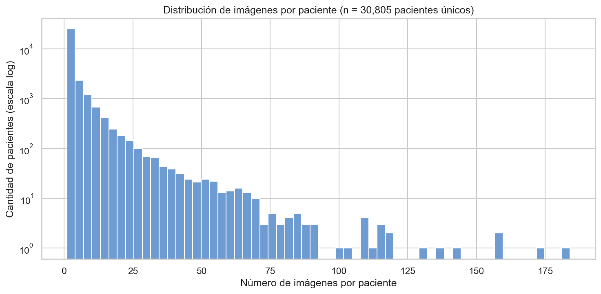

# Fase de Análisis del Dataset NIH ChestX-ray14

**Proyecto de Aula — Inteligencia Artificial — III Corte (Fase 3)**
Universidad Popular del Cesar — Facultad de Ingeniería de Sistemas — 2026-I

**Integrantes:** Mateo López Patiño, Anaclaudia Vega Martínez, Tonny Enrique Jiménez Márquez

---

## Resumen ejecutivo

Este documento desarrolla el **Objetivo Específico 4.2.1** definido en la Fase 2:

> *Analizar las características y estructura del conjunto de datos de radiografías de tórax de los NIH para su adecuado procesamiento y uso en el modelo de inteligencia artificial.*

El análisis se realizó sobre el archivo `Data_Entry_2017.csv` del NIH ChestX-ray14, junto con los archivos de splits oficiales `train_val_list.txt` y `test_list.txt`. El conjunto contiene **112.120 radiografías frontales de 30.805 pacientes únicos**, etiquetadas con **14 patologías torácicas**.

Cada sección de este documento explica:

- **Qué se analizó** (gráfica o tabla generada).
- **Cómo se lee** la información presentada.
- **Qué hallazgo importante** se desprende.
- **Qué decisión de diseño** se toma para las siguientes fases del proyecto.

---

## 1. Inspección inicial del dataset

### 1.1. Volumen y composición (Tabla 1)

Tras cargar el CSV, el notebook imprimió:

```
Filas (imágenes): 112,120
Columnas        : 12
```

| Métrica | Valor |
|---|---|
| Total de imágenes | 112.120 |
| Columnas en el CSV | 12 (11 útiles + 1 columna basura) |
| Pacientes únicos | 30.805 |
| Patologías etiquetadas | 14 |

**Cómo se lee**: cada fila del CSV equivale a una radiografía individual. La columna basura aparece porque el NIH dejó una coma sobrante al final de cada línea del CSV original; se descarta automáticamente al renombrar columnas.

**Por qué importa**: confirma que el dataset se cargó completo y que no hay corrupción.

### 1.2. Esquema renombrado del CSV

Los nombres originales del NIH son largos y difíciles de usar en código, por lo que se renombraron:

| Columna NIH | Renombrada | Descripción |
|---|---|---|
| `Image Index` | `image_id` | Nombre del archivo PNG (ej.: `00000001_000.png`) |
| `Finding Labels` | `labels_raw` | Patologías separadas por `\|` |
| `Follow-up #` | `followup` | Número de seguimiento (0 = primer estudio) |
| `Patient ID` | `patient_id` | ID anónimo del paciente |
| `Patient Age` | `age` | Edad del paciente |
| `Patient Gender` | `gender` | M (masculino) o F (femenino) |
| `View Position` | `view` | PA (PosteroAnterior) o AP (AnteroPosterior) |
| `OriginalImage[Width` | `img_w` | Ancho original (píxeles) |
| `Height]` | `img_h` | Alto original (píxeles) |
| `OriginalImagePixelSpacing[x` | `spacing_x` | Espaciado horizontal (mm/píxel) |
| `y]` | `spacing_y` | Espaciado vertical (mm/píxel) |

### 1.3. Calidad de los datos (Tabla 2)

```
Información general:
RangeIndex: 112120 entries, 0 to 112119
Data columns (total 11 columns):
 #   Column      Non-Null Count   Dtype
 0   image_id    112120 non-null  str
 1   labels_raw  112120 non-null  str
 ...
memory usage: 9.4 MB

Valores nulos por columna:
image_id      0
labels_raw    0
... (todas en 0)
```

**Cómo se lee**: la columna *Non-Null Count* muestra que las 112.120 entradas tienen valor en todas las columnas. Cero valores nulos en todo el dataset.

**Por qué importa**: NO hay que imputar ni descartar datos. El dataset está limpio de fábrica. El uso en RAM (9,4 MB) es bajo, lo que permite hacer todo el EDA en local sin problemas de memoria.

**Decisión de diseño**: omitir el paso de limpieza de NaN. Solo filtraremos 16 edades atípicas (>120 años o ≤0) en el análisis demográfico, sin afectar el entrenamiento general.

### 1.4. Ejemplo de registros (Tabla 3)

Las primeras 5 filas del DataFrame revelan la estructura real de los datos:

| image_id | labels_raw | followup | patient_id | age | gender | view |
|---|---|---|---|---|---|---|
| 00000001_000.png | Cardiomegaly | 0 | 1 | 58 | M | PA |
| 00000001_001.png | Cardiomegaly\|Emphysema | 1 | 1 | 58 | M | PA |
| 00000001_002.png | Cardiomegaly\|Effusion | 2 | 1 | 58 | M | PA |
| 00000002_000.png | No Finding | 0 | 2 | — | — | — |
| 00000003_000.png | Hernia | 0 | 3 | 81 | F | — |

**Cómo se lee**:

- El paciente con `patient_id=1` aparece **3 veces** (followups 0, 1, 2): es el mismo señor de 58 años en visitas distintas. En su primera visita solo tiene `Cardiomegaly`, después se agrega `Emphysema`, y luego `Effusion`. Esto evidencia que el dataset contiene seguimientos longitudinales de pacientes.
- El paciente 3 es una mujer de 81 años con Hernia (consistente con la prevalencia que veremos: la Hernia aparece casi solo en adultos mayores).

**Por qué importa**: prueba en datos reales que **no se puede hacer un split aleatorio por imagen**, porque las múltiples imágenes de un mismo paciente caerían en distintos conjuntos. Esta observación fundamenta toda la estrategia de división de datos.

---

## 2. Codificación multi-etiqueta (Tabla 4)

A partir de la columna `labels_raw` (texto separado por `|`), se construyeron 14 columnas binarias (una por patología) más dos columnas auxiliares (`No Finding` y `n_findings`). El DataFrame final tiene **112.120 × 23 columnas**.

| image_id | labels_raw | n_findings | Atelectasis | Cardiomegaly | Effusion | Infiltration | Mass | … |
|---|---|---|---|---|---|---|---|---|
| 00000001_000.png | Cardiomegaly | 1 | 0 | 1 | 0 | 0 | 0 | … |
| 00000001_001.png | Cardiomegaly\|Emphysema | 2 | 0 | 1 | 0 | 0 | 0 | … |
| 00000001_002.png | Cardiomegaly\|Effusion | 2 | 0 | 1 | 1 | 0 | 0 | … |
| 00000002_000.png | No Finding | 0 | 0 | 0 | 0 | 0 | 0 | … |
| 00000003_000.png | Hernia | 1 | 0 | 0 | 0 | 0 | 0 | … |

**Cómo se lee**: se transformó el texto `"Cardiomegaly|Effusion"` en un vector binario `[0, 1, 0, 0, 1, 0, ...]` (uno por cada patología). Esto se llama **one-hot encoding multi-etiqueta**.

**Por qué importa**: este es el formato que el modelo necesita para entrenar. Cada salida de la red predecirá uno de estos 14 valores. El modelo NO aprende del texto crudo, aprende del vector numérico.

**Decisión de diseño**:

- **NO se usa softmax** (que asigna una sola clase con probabilidades que suman 100%).
- **SÍ se usa sigmoid por cada clase** (cada patología tiene su propia probabilidad independiente, de 0 a 1).
- La función de pérdida es **Binary Cross-Entropy** aplicada 14 veces, no Cross-Entropy.

---

## 3. Distribución de las 14 patologías

### 3.1. Frecuencia por patología (Gráfica 1 + Tabla)



| Patología | Casos | % |
|---|---|---|
| Infiltration | 19.894 | 17,74 |
| Effusion | 13.317 | 11,88 |
| Atelectasis | 11.559 | 10,31 |
| Nodule | 6.331 | 5,65 |
| Mass | 5.782 | 5,16 |
| Pneumothorax | 5.302 | 4,73 |
| Consolidation | 4.667 | 4,16 |
| Pleural_Thickening | 3.385 | 3,02 |
| Cardiomegaly | 2.776 | 2,48 |
| Emphysema | 2.516 | 2,24 |
| Edema | 2.303 | 2,05 |
| Fibrosis | 1.686 | 1,50 |
| Pneumonia | 1.431 | 1,28 |
| **Hernia** | **227** | **0,20** |

**Qué muestra la gráfica**: una barra horizontal por patología, ordenadas de la más común (arriba) a la más rara (abajo). El número al lado de cada barra indica casos absolutos y porcentaje.

**Cómo se lee**: la patología más frecuente es Infiltration (19.894 casos = 17,7% de todas las imágenes). La más rara es Hernia (solo 227 casos = 0,2%).

**Hallazgo crítico**: Infiltration tiene **87 veces más casos que Hernia**. Esto se llama **desbalance extremo de clases**.

**Por qué importa**: si el modelo se entrena así sin más, va a aprender a "siempre decir que NO hay Hernia" porque acertaría el 99,8% de las veces solo por la frecuencia. Pero un modelo que nunca detecta Hernia es inútil para uso clínico.

**Decisiones de diseño**:

- Usar `BCEWithLogitsLoss` con **`pos_weight`** para penalizar más los falsos negativos en clases minoritarias.
- Evaluar con **AUC-ROC y F1-Score por clase**, no con accuracy global.
- Considerar técnicas de oversampling o data augmentation diferencial para clases minoritarias.

### 3.2. Sano vs con hallazgo (Gráfica 2 + Tabla)



```
Imágenes 'No Finding'        : 60,361 (53.84%)
Imágenes con ≥1 patología    : 51,759 (46.16%)
```

| Categoría | Imágenes | % |
|---|---|---|
| Sin hallazgo (No Finding) | 60.361 | 53,84 |
| Con al menos 1 patología | 51.759 | 46,16 |

**Cómo se lee**: el dataset está aproximadamente balanceado entre radiografías sanas y enfermas (54% / 46%). Pero ese 46% se reparte entre las 14 patologías, por lo que individualmente cada patología es mucho menos frecuente que "No Finding".

**Por qué importa**: tener tantas imágenes sanas le permite al modelo aprender qué es "normal", lo cual es bueno. Pero también significa que la clase "No Finding" sería la mayoritaria si la incluyéramos como una clase más.

**Decisión de diseño**: el modelo tendrá 14 salidas (no 15). "No Finding" se representa implícitamente cuando todas las 14 salidas están bajas.

---

## 4. Análisis multi-etiqueta

### 4.1. Cantidad de patologías por imagen (Gráfica 3 + Tabla 5)



| Patologías | Imágenes |
|---|---|
| 0 (sano) | 60.361 |
| 1 | 30.963 |
| 2 | 14.306 |
| 3 | 4.856 |
| 4 | 1.247 |
| 5 | 301 |
| 6 | 67 |
| 7 | 16 |
| 8 | 1 |
| 9 | 2 |

**Estadísticas descriptivas** (`n_findings.describe()`):

```
count    112120.000000
mean          0.724010
std           0.963195
min           0.000000
25%           0.000000
50%           0.000000
75%           1.000000
max           9.000000
```

**Cómo se lee**:

- **mean = 0,72**: cada radiografía tiene en promedio 0,72 patologías. El promedio bajo se debe a que la mediana es 0 (la mitad de las imágenes son sanas).
- **min = 0, max = 9**: hay imágenes con 0 hasta 9 patologías simultáneas. Los casos con 8 o 9 patologías son extremos clínicos (probablemente UCI).
- **75% = 1**: el 75% de las imágenes tiene 1 o menos patologías.

**Hallazgo crítico**: el 22% de las imágenes con hallazgos tienen 2 o más patologías al mismo tiempo. **El problema no es de clasificación con clases excluyentes**: una radiografía puede ser simultáneamente neumonía + efusión + atelectasia.

**Por qué importa**: es la diferencia más importante entre clasificación normal y clasificación multi-etiqueta. Si te lo preguntan en sustentación, este es el punto a destacar.

**Decisión de diseño**: ya consolidada en la sección 2 (sigmoid + BCE en lugar de softmax + Cross-Entropy).

### 4.2. Co-ocurrencia condicional de patologías (Gráfica 4)



**Cómo se lee la matriz**: cada celda dice "si la radiografía tiene la patología de la **fila**, ¿qué probabilidad hay de que también tenga la patología de la **columna**?". Las diagonales son 1,00 (cada patología consigo misma).

**Pares con correlación más fuerte**:

| Si tiene… | Probabilidad de también tener… | Justificación clínica |
|---|---|---|
| **Edema** | Infiltration: **0,43** | El edema pulmonar produce líquido visible como infiltración |
| **Pneumonia** | Infiltration: **0,42** | La neumonía se manifiesta como infiltrado pulmonar |
| **Cardiomegaly** | Effusion: **0,38** | Insuficiencia cardíaca → derrame pleural |
| **Emphysema** | Pneumothorax: **0,30** | El enfisema debilita el tejido y favorece el colapso pulmonar |
| **Effusion** | Infiltration: **0,30** | Derrame pleural acompaña frecuentemente a infiltrados |
| **Atelectasis** | Effusion: **0,28** | Comparten causas (compresión, obstrucción) |
| **Pneumonia** | Edema: **0,24** | Procesos inflamatorios coexistentes |

**Por qué importa**: las patologías **no son independientes**. Aunque el modelo las traduce como 14 salidas separadas, comparten información visual: una imagen con neumonía suele tener infiltrado, una con cardiomegalia suele tener efusión, etc.

**Decisión de diseño**: usar arquitecturas con **representaciones compartidas** como DenseNet-121, ResNet-50 o EfficientNet. Una sola CNN extrae características de la imagen completa, y luego 14 cabezas independientes deciden cada patología. Así el modelo aprovecha las correlaciones implícitas.

---

## 5. Demografía y prevalencias por edad

### 5.1. Distribución general (Gráfica 5)



**Tres paneles de la gráfica**:

#### Panel 1: Edad

```
Pacientes con edad atípica (>120 o ≤0): 16
count    112104.0
mean         46.9
std          16.6
min           1.0
25%          35.0
50%          49.0
75%          59.0
max          95.0
```

**Cómo se lee**:

- 16 imágenes tenían edades absurdas (>120 o ≤0); errores de captura del NIH. Se descartan del análisis demográfico (no del entrenamiento general).
- Después del filtro, 112.104 imágenes quedan en el análisis.
- **Mediana = 49 años, mean = 46,9**: dataset centrado en adultos de mediana edad.
- **min = 1, max = 95**: rango amplio (bebés hasta adultos mayores).
- Entre 35 y 59 años está la mitad central de los pacientes.

#### Panel 2: Género

| Género | Imágenes | % |
|---|---|---|
| Masculino (M) | 63.340 | 56,5 |
| Femenino (F) | 48.780 | 43,5 |

**Cómo se lee**: ligero desbalance hacia hombres (56,5% vs 43,5%), no preocupante para el entrenamiento.

#### Panel 3: Vista de la radiografía

| Vista | Imágenes | % |
|---|---|---|
| PA (PosteroAnterior) | 67.310 | 60,0 |
| AP (AnteroPosterior) | 44.810 | 40,0 |

**Cómo se lee**: 60% son tomadas con el paciente de pie de espaldas al equipo (PA, vista preferida). 40% son AP (paciente acostado, típico en UCI).

**Por qué importa la vista**: en la AP el corazón se ve más grande artificialmente por efecto de magnificación. Los radiólogos compensan esto, pero el modelo no, a menos que se lo digamos.

**Decisión de diseño**:

- **Modelo base**: solo imagen (DenseNet-121). Más simple, más comparable con la literatura.
- **Modelo mejorado opcional**: imagen + datos clínicos (edad, género, vista) concatenados antes de la capa final. Esto se llama **modelo multi-modal** y es un plus académico.

### 5.2. Prevalencia por grupo etario (Gráfica 6)



**Cómo se lee**: cada celda es el porcentaje de imágenes con esa patología dentro del grupo etario correspondiente. Colores más oscuros = mayor prevalencia.

**Patrones que aumentan con la edad** (consistente con epidemiología real):

| Patología | 0-18 años | 76+ años | Multiplicador |
|---|---|---|---|
| Effusion | 8,5% | 17,2% | ×2,0 |
| Atelectasis | 6,6% | 13,1% | ×2,0 |
| Fibrosis | 0,4% | 3,3% | **×8,3** |
| Emphysema | 2,0% | 3,9% | ×2,0 |
| Hernia | 0,0% | 1,7% | (de 0 a 1,7%) |

**Patrones que disminuyen con la edad**:

- Infiltration: 19,9% en niños → 16,9% en adultos mayores.
- Pneumothorax: 6,1% en niños → 4,8% en mayores.

**Estables**:

- Cardiomegaly y Pneumonia: prevalencia similar en todas las edades.

**Por qué importa**: este gráfico **valida** que el dataset captura patrones epidemiológicos reales. Sirve para el documento argumentar que:

1. El dataset NIH es **clínicamente representativo**.
2. La **edad es una variable predictiva** legítima → justifica integrarla en un modelo multi-modal.

**Decisión de diseño**: reportar AUC también **estratificado por grupo etario** en la evaluación final, no solo el AUC global.

---

## 6. Análisis a nivel paciente (Gráfica 7 + Tabla 7)



**Estadísticas por paciente** (`img_por_paciente.describe()`):

```
Total de pacientes únicos: 30,805
count    30805.0
mean         3.6
std          7.4
min          1.0
25%          1.0
50%          1.0
75%          3.0
max        184.0
```

**Cómo se lee**:

- **30.805 pacientes únicos** generaron 112.120 imágenes → en promedio cada paciente tiene 3,6 radiografías.
- **Mediana = 1**: la mitad de los pacientes solo tiene 1 imagen.
- **75% = 3**: 3 de cada 4 pacientes tienen 3 o menos imágenes.
- **max = 184**: existe **un paciente con 184 radiografías** (caso extremo, probablemente un paciente crónico con seguimiento prolongado).

**Top pacientes con más imágenes**:

```
patient_id
13118    184
13985    142
20054    135
13620    121
17651    121
```

**Hallazgo crítico**: si dividiéramos los datos al azar (típico `train_test_split(shuffle=True)`), **las 184 imágenes del paciente 13118 se repartirían entre train, val y test**. El modelo aprendería a reconocer las costillas únicas de ese paciente, y "acertaría" en validación/test no porque sabe diagnosticar, sino porque memorizó al paciente. Esto se llama **Data Leakage**, y es el peor pecado al evaluar modelos médicos.

**Decisión de diseño** (la más importante de toda la fase):

> **Todas las divisiones del dataset deben ser a nivel de paciente.** Las 184 imágenes del paciente 13118 deben quedar **completamente** en train, o **completamente** en val, o **completamente** en test. Nunca repartidas.

En la implementación esto se logra con `GroupKFold(groups=patient_id)` o splits oficiales del NIH (siguiente sección).

---

## 7. Splits oficiales del NIH

### 7.1. Distribución por split (Tabla 8)

El NIH publicó dos archivos de texto con la división oficial:

- `train_val_list.txt`: imágenes para entrenamiento + validación.
- `test_list.txt`: imágenes reservadas para evaluación final.

| Split | Imágenes | % imágenes | Pacientes únicos |
|---|---|---|---|
| `train_val` | 86.524 | 77,2 | 28.008 |
| `test` | 25.596 | 22,8 | 2.797 |
| **Total** | **112.120** | **100,0** | **30.805** |

**Verificación crítica de leakage** (`set(train_val.patient_id) ∩ set(test.patient_id)`):

```
Pacientes en train_val ∩ test: 0
```

**Cómo se lee**: la intersección de IDs de pacientes entre `train_val` y `test` es exactamente **0**. Ningún paciente aparece en ambos conjuntos.

**Por qué importa**: los splits oficiales del NIH **ya están bien hechos**. No tenemos que reinventar la rueda ni preocuparnos por la división paciente/imagen.

**Decisión de diseño**:

- **Respetar los splits oficiales**: usar `train_val_list.txt` como pool de entrenamiento+validación, y `test_list.txt` solo para la evaluación final.
- **Subdividir `train_val` con `GroupKFold(n_splits=5, groups=patient_id)`** para crear nuestro propio conjunto de validación interno (los 28.008 pacientes se dividen, no las 86.524 imágenes).
- **Reportar resultados sobre `test`** para hacerlos comparables con la literatura (Wang et al. 2017, CheXNet 2017, etc.).

### 7.2. Comparación de prevalencias entre splits (Tabla 9)

| Patología | train_val % | test % | Diferencia |
|---|---|---|---|
| Atelectasis | 8,84 | 15,76 | **+6,92** |
| Cardiomegaly | 1,98 | 4,42 | +2,44 |
| Consolidation | 3,57 | 6,15 | +2,58 |
| Edema | 1,69 | 3,30 | +1,61 |
| Effusion | 10,01 | 18,20 | **+8,19** |
| Emphysema | 1,99 | 3,11 | +1,12 |
| Fibrosis | 1,29 | 2,29 | +1,00 |
| Hernia | 0,16 | 0,33 | +0,17 |
| Infiltration | 16,32 | 22,57 | +6,25 |
| Mass | 4,51 | 7,38 | +2,87 |
| Nodule | 4,99 | 7,90 | +2,91 |
| Pleural_Thickening | 2,55 | 4,60 | +2,05 |
| Pneumonia | 1,06 | 2,07 | +1,01 |
| Pneumothorax | 3,05 | 10,41 | **+7,36** |

**Cómo se lee**: la prevalencia de **TODAS** las patologías es **MAYOR en `test`** que en `train_val`. Por ejemplo, Pneumothorax pasa del 3,05% al 10,41% (más del triple).

**Hallazgo importante**: el conjunto de prueba está **enriquecido en casos enfermos**. Esto no es un error: el NIH lo diseñó así deliberadamente para que el `test` set sea más exigente clínicamente.

**Implicaciones críticas**:

1. **Las métricas en `test` serán inferiores que en validación**, no porque el modelo esté sobreajustado, sino porque se enfrenta a un escenario más difícil. Hay que documentar esto en el informe.

2. **Accuracy global engaña aún más**: si una patología es 10% más común en test, el modelo que "siempre predice negativo" obtiene peor accuracy en test sin haber cambiado.

3. **AUC-ROC es la métrica adecuada**: AUC mide separabilidad de clases independientemente de la prevalencia. Es la métrica estándar reportada en CheXNet y por eso se eligió como métrica principal del proyecto.

**Decisión de diseño**:

- **Métrica principal**: AUC-ROC promedio macro sobre las 14 clases.
- **Métricas secundarias**: AUC-ROC por clase, F1-Score, sensibilidad y especificidad por clase.
- **Reporte estratificado**: comparar resultados train_val vs test explícitamente en el informe.

---

## 8. Características técnicas de las imágenes

### 8.1. Resolución original (Tabla 10)

```
Resolución original (img_w × img_h):
       Ancho     Alto
count  112120   112120
mean    2646.4   2486.4
std      341.7    400.6
min     1143.0    966.0
25%     2500.0   2048.0
50%     2544.0   2484.0
75%     2992.0   2991.0
max     3827.0   4715.0
```

**Cómo se lee**:

- **Resolución promedio**: 2.646 × 2.486 píxeles (≈6,6 megapíxeles por imagen). Imágenes muy grandes.
- **Tamaño mínimo**: 1.143 × 966 → suficiente incluso después de redimensionar a 224 × 224.
- **Tamaño máximo**: 3.827 × 4.715 → imágenes enormes que ocupan ≈18 MB cada una en PNG.

**Por qué importa**: el dataset completo pesa ≈42 GB descomprimido por la alta resolución. No tiene sentido entrenar a resolución original (no cabe en GPU y multiplica el tiempo de entrenamiento por 100).

**Decisión de diseño**:

- **Redimensionar a 224 × 224 píxeles**. Es el tamaño estándar de los modelos pre-entrenados en ImageNet (DenseNet-121, ResNet-50).
- Se acepta la pérdida de detalle fino. Esto es estándar en la literatura (CheXNet usó 224×224).
- Para iteraciones futuras: probar 320×320 o 512×512 si la GPU lo permite (puede mejorar AUC en lesiones pequeñas como nódulos).

### 8.2. Espaciado de píxel (Tabla 11)

```
Espaciado de píxel (mm/píxel):
        spacing_x  spacing_y
count   112120     112120
mean       0.156      0.156
std        0.017      0.017
min        0.115      0.115
25%        0.143      0.143
50%        0.143      0.143
75%        0.171      0.171
max        0.198      0.198
```

**Cómo se lee**: cada píxel representa entre 0,115 mm y 0,198 mm en el mundo real (mediana 0,143 mm/píxel). La desviación estándar es muy baja (0,017), lo que indica que el equipo de captura era consistente.

**Por qué importa**: garantiza que las distancias relativas entre estructuras anatómicas son comparables entre imágenes. No hay deformaciones extrañas.

**Decisión de diseño**: en esta primera versión del modelo no se usa el spacing como input. Se podría usar en una versión posterior para normalizar tamaños absolutos (ej.: tamaño real de un nódulo en mm).

### 8.3. Pipeline de preprocesamiento

A partir de las observaciones anteriores:

1. **Lazy loading**: cargar las imágenes desde disco solo cuando el DataLoader las necesite (no precargar las 112.120 en RAM).
2. **Redimensionar** a 224 × 224 píxeles con `torchvision.transforms.Resize` (interpolación bilineal).
3. **Conversión a 3 canales**: las radiografías son monocromáticas, pero los modelos pre-entrenados esperan 3 canales (RGB). Se replica el canal de gris 3 veces.
4. **Normalización** con la media y desviación estándar de ImageNet:
   - `mean = [0.485, 0.456, 0.406]`
   - `std  = [0.229, 0.224, 0.225]`
5. **Data augmentation** solo en train:
   - Rotación leve (±5° máximo, las radiografías son anatómicamente fijas).
   - Traslaciones suaves.
   - Flip horizontal (debatible: cambia la lateralidad cardíaca, mejor evitarlo o usarlo solo cuando no se evalúa cardiomegalia).
6. **No se aplica ningún filtro de color ni inversión de intensidades**.

---

## 9. Productos finales de esta fase (Tabla 12)

| Producto | Ruta | Función |
|---|---|---|
| Notebook EDA | `notebooks/01_eda_metadata.ipynb` | Reproduce todo el análisis paso a paso |
| Metadatos crudos | `data/raw/Data_Entry_2017.csv` | CSV original del NIH (112.120 filas) |
| Metadatos limpios | `data/processed/metadata_clean.csv` | DataFrame con 23 columnas + columna `split` |
| Lista train/val | `data/raw/train_val_list.txt` | 86.524 imágenes oficiales |
| Lista test | `data/raw/test_list.txt` | 25.596 imágenes oficiales |
| Bounding boxes | `data/raw/BBox_List_2017.csv` | 984 cajas para validar Grad-CAM |
| Figura 1 | `outputs/figures/01_distribucion_patologias.png` | Distribución de las 14 clases |
| Figura 2 | `outputs/figures/02_no_finding_vs_finding.png` | Sano vs con hallazgo |
| Figura 3 | `outputs/figures/03_hallazgos_por_imagen.png` | Cantidad de patologías por imagen |
| Figura 4 | `outputs/figures/04_cooccurrence.png` | Heatmap de co-ocurrencia |
| Figura 5 | `outputs/figures/05_demografia.png` | Edad, género, vista |
| Figura 6 | `outputs/figures/06_prevalencia_por_edad.png` | Prevalencia por grupo etario |
| Figura 7 | `outputs/figures/07_imgs_por_paciente.png` | Distribución por paciente |
| Documento de análisis | `docs/01_fase_analisis.md` | Este informe |

---

## 10. Decisiones de diseño consolidadas

Tabla resumen para la sustentación. Cada decisión está respaldada por el hallazgo correspondiente:

| Aspecto | Decisión | Justificación |
|---|---|---|
| **Tipo de problema** | Multi-etiqueta | Las imágenes tienen entre 0 y 9 patologías simultáneas (Sección 4.1) |
| **Activación de salida** | Sigmoid (14 neuronas independientes) | No son clases excluyentes (Sección 4.1) |
| **Función de pérdida** | `BCEWithLogitsLoss` con `pos_weight` | Desbalance extremo: Infiltration es 87× más común que Hernia (Sección 3.1) |
| **Métrica principal** | AUC-ROC macro | Robusta al desbalance y a diferencias de prevalencia entre splits (Secciones 3.1, 7.2) |
| **Métricas secundarias** | F1, sensibilidad, especificidad por clase | Importantes en aplicaciones clínicas |
| **División train/val/test** | Splits oficiales NIH + GroupKFold por `patient_id` | Pacientes con hasta 184 imágenes; intersección train/test = 0 (Secciones 6, 7.1) |
| **Resolución de entrada** | 224 × 224 px (RGB replicado) | Compatibilidad con modelos ImageNet (Sección 8.1) |
| **Normalización** | Estadísticas de ImageNet | Estándar para transfer learning (Sección 8.3) |
| **Arquitectura base** | DenseNet-121 (CheXNet) | Aprovecha co-ocurrencia entre patologías (Sección 4.2) |
| **Modelo opcional** | Multi-modal con edad + género + vista | La edad muestra patrones epidemiológicos claros (Sección 5.2) |
| **Estrategia de entrenamiento** | Transfer learning desde ImageNet | Estado del arte para imágenes médicas con datasets limitados |
| **Hardware** | Kaggle Notebooks (Tesla T4 / P100) | El equipo local usa AMD RX 580 sin soporte CUDA |
| **Interpretabilidad** | Grad-CAM | Validar predicciones contra las 984 bounding boxes del NIH |

---

## 11. Conclusiones

1. **El dataset NIH ChestX-ray14 está limpio**: cero valores nulos, esquema bien documentado, splits oficiales libres de leakage. No hay que invertir tiempo en limpieza profunda.

2. **El problema es genuinamente multi-etiqueta**: el 22% de las imágenes con hallazgos tienen 2 o más patologías simultáneas. Esto define toda la arquitectura del modelo.

3. **Hay desbalance extremo entre clases**: Infiltration es 87 veces más frecuente que Hernia. Esto exige técnicas específicas (`pos_weight`, AUC-ROC en lugar de accuracy).

4. **Las patologías están correlacionadas**: hay pares con co-ocurrencia condicional del 30-43%. Esto justifica usar arquitecturas con representaciones compartidas (DenseNet, ResNet).

5. **La edad es una variable predictiva**: Fibrosis se multiplica por 8 en mayores de 75 años, Hernia es casi exclusiva de adultos mayores. Esto justifica la opción de un modelo multi-modal.

6. **El leakage por paciente es el mayor riesgo**: existen pacientes con hasta 184 imágenes. Cualquier división aleatoria por imagen invalidaría las métricas. Los splits oficiales del NIH ya resuelven esto correctamente.

7. **El test set es deliberadamente difícil**: todas las patologías son más prevalentes en test que en train_val. Las métricas en test serán menores que en validación, y eso debe documentarse explícitamente en el informe final.

8. **El pipeline técnico está definido**: 224×224 px, RGB replicado, normalización ImageNet, lazy loading, augmentation suave.

Con estas conclusiones, el proyecto está listo para pasar a la **Fase de Diseño**, donde se implementarán los scripts:

- `src/data/build_splits.py` — particiona `train_val` en train/val con `GroupKFold` por paciente.
- `src/data/dataset.py` — clase `ChestXrayDataset` de PyTorch con lazy loading.
- `src/data/transforms.py` — pipeline de preprocesamiento y data augmentation.
- `src/models/densenet_chexnet.py` — DenseNet-121 con cabeza multi-etiqueta.
- `notebooks/02_kaggle_training.ipynb` — entrenamiento en Kaggle Notebooks.

